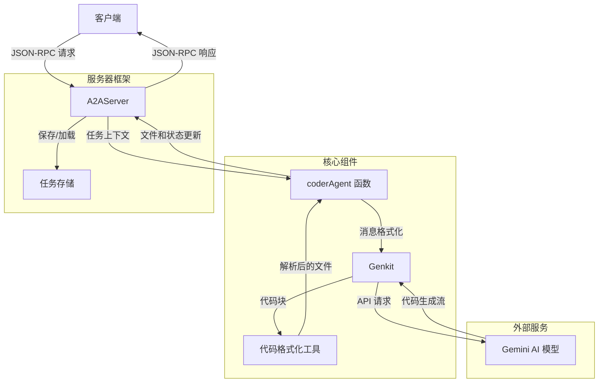

# Coder Agent 架构分析

## 概述

Coder Agent 是一个基于 A2A（Agent-to-Agent）协议实现的代码生成代理系统。它使用 Gemini AI 模型根据自然语言指令生成代码，并以流式方式返回结果。该系统设计为一个独立的服务，通过 JSON-RPC API 与客户端通信。

### 代理架构类型

这是一个 **Single Agent** 架构，而非多代理协作系统。整个系统只有一个代理（Coder Agent），它负责处理所有的代码生成请求。Genkit 不是一个独立的代理，而是 Coder Agent 用来与 Gemini AI 模型交互的工具库。系统的工作流程是线性的：

1. Coder Agent 接收请求
2. 使用 Genkit 工具调用 Gemini AI 模型
3. 处理返回的代码
4. 将结果发送回客户端

这种单代理架构简化了系统设计，使得代码生成流程更加直接和可控。

## 架构图



## 核心组件详解

### 1. coderAgent 函数

这是代理的核心实现，它是一个异步生成器函数，接收任务上下文并生成代码：

```typescript
async function* coderAgent({
  task,
  history,
}: TaskContext): AsyncGenerator<TaskYieldUpdate, schema.Task | void, unknown> {
  // ...
}
```

主要功能：
- 将 A2A 历史记录转换为 Genkit 消息格式
- 使用 Gemini AI 模型生成代码
- 处理流式响应，将代码组织成文件
- 通过 `yield` 语句返回状态更新和文件内容

### 2. A2AServer

提供符合 A2A 规范的 JSON-RPC API，处理客户端请求：

```typescript
const server = new A2AServer(coderAgent, {
  card: coderAgentCard,
});
```

主要功能：
- 处理任务请求、响应和状态更新
- 管理任务状态和历史记录
- 提供流式响应支持

### 3. 代码格式化工具

`CodeMessage` 类和相关函数处理代码生成的格式化和解析：

```typescript
export class CodeMessage implements CodeMessageData {
  // ...
}

export function defineCodeFormat(ai: GenkitBeta) {
  // ...
}
```

主要功能：
- 定义代码输出的格式
- 解析 AI 生成的代码块
- 提取文件名、语言和内容

### 4. Genkit 集成

使用 Genkit 库与 Gemini AI 模型交互：

```typescript
export const ai = genkit({
  plugins: [googleAI()],
  model: gemini20Flash.withConfig({ version: "gemini-2.5-pro-exp-03-25" }),
});
```

主要功能：
- 配置 AI 模型和参数
- 处理 AI 请求和响应
- 支持流式生成

## 工作流程

1. **初始化**：
   - 服务器启动并监听端口 41241
   - 注册 coderAgent 作为任务处理器

2. **请求处理**：
   - 客户端发送包含自然语言指令的 JSON-RPC 请求
   - A2AServer 接收请求并创建任务上下文
   - 调用 coderAgent 函数处理任务

3. **代码生成**：
   - coderAgent 将历史消息映射为 Genkit 格式
   - 使用 Gemini AI 模型生成代码
   - AI 以流式方式返回代码块

4. **结果处理**：
   - 代码被解析成文件，并存储在内存中
   - 文件按顺序通过 `yield` 语句返回
   - 服务器将文件作为任务工件发送给客户端

5. **完成通知**：
   - 所有文件生成完成后，发送完成状态
   - 返回生成的文件列表

## 技术栈

- **TypeScript**：主要编程语言
- **Express.js**：用于 HTTP 服务器
- **Genkit**：用于与 Gemini AI 模型交互
- **JSON-RPC 2.0**：用于 API 通信协议
- **Gemini AI**：代码生成模型

## 关键特性

1. **流式响应**：代码生成结果以流的形式返回，提供实时反馈
2. **多文件支持**：可以生成多个文件，每个文件作为单独的工件返回
3. **状态管理**：完整的任务状态管理，包括提交、处理中、完成等状态
4. **历史记录**：支持使用对话历史进行上下文感知的代码生成

## 配置和扩展

系统设计为可配置和可扩展的：
- 可以更改 AI 模型和参数
- 可以自定义代码格式和输出
- 可以集成到更大的系统中作为代码生成服务
